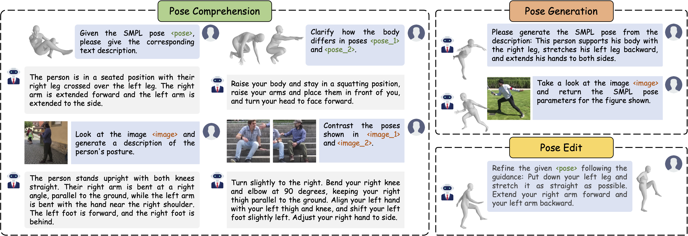

<div align="center">

<h1>UniPose: A Unified Multimodal Framework for Human Pose Comprehension, Generation and Editing</h1>

<div>
    <strong>CVPR 2025</strong>
</div>

<div>
    <h4 align="center">
        <a href="https://www.arxiv.org/abs/2411.16781" target='_blank'>
            
        </a>
        <a href="https://liyiheng23.github.io/UniPose-Page/" target='_blank'>
            
        </a>
    </h4>
</div>

⭐ If UniPose is helpful to your projects, please help star this repo. Thanks! 🤗

</div>

<be>

<div align="center">

</div>

This repository contains the official implementation of **UniPose**. UniPose is a multi-modal LLM to understand, generate and edit 3D human poses. It enables seamless transformation of human poses across multi-modalities (visual, text, SMPL) and multi-tasks (comprehension, generation, editing).

## 🔧 Dependencies and Installation

1. Clone this repo and navigate to UniPose folder

   ```bash
   git clone https://github.com/liyiheng23/UniPose.git
   cd UniPose
   ```

2. Create Conda Environment and Install Package

   ```bash
   conda create -n unipose python=3.10 -y
   conda activate unipose
   pip3 install -r requirements.txt
   ```
3. Download Pre-trained Models and put these models under `./cache` folder. 
      #### Base Model:
      * `CLIP-ViT`: [openai/clip-vit-large-patch14-336](https://huggingface.co/openai/clip-vit-large-patch14-336)
      * `LLaVA`: [liuhaotian/llava-v1.6-mistral-7b](https://huggingface.co/liuhaotian/llava-v1.6-mistral-7b)
      * `smpl_models`: [smplx](https://smpl-x.is.tue.mpg.de)
      #### Ours provided Model:
      * `unipose`: [L-yiheng/UniPose](https://huggingface.co/L-yiheng/UniPose)
      * `tokenhmr_model`: [tokenhmr_model](https://drive.google.com/file/d/1RZfB3oD2LitzQTKhc7dDX4IB0bY8yCEt/view?usp=share_link)
      * `pose-vqvae`: [pose-vqvae](https://drive.google.com/drive/folders/1YSPZNjkIrFnSFnRDbyYh1JeW5G9fjDfw?usp=share_link)
    
    Now under `./cache`, you should be able to see the following: 

    ```shell
    cache
    ├── clip-vit-large-patch14-336
    ├── llava-v1.6-mistral-7b
    ├── pose_vqvae
    │   └── best_MPJPE.ckpt
    ├── smpl_models
    │   └── smplx
    │       ├── SMPLX_FEMALE.npz
    │       ├── SMPLX_MALE.npz
    │       └── SMPLX_NEUTRAL.npz
    ├── tokenhmr_model.ckpt
    └── unipose
    ```


## ⚡ Inference

```shell
python inference.py \
    --model-path cache/unipose \
    --model-base cache/llava-v1.6-mistral-7b \
    --config configs/inference.py
```

## 🪪 License

The provided code and pre-trained weights are licensed under the [Apache 2.0 license](LICENSE).

## 🤗 Acknowledgement

This code is based on [ChatPose](https://github.com/yfeng95/PoseGPT), [LISA](https://github.com/dvlab-research/LISA), [LLaVA](https://github.com/haotian-liu/LLaVA) and [PoseScript](https://github.com/naver/posescript). Some code are brought from [TokenHMR](https://github.com/saidwivedi/TokenHMR), [4D-Humans](https://github.com/shubham-goel/4D-Humans). We thank the authors for their awesome work.

## 📧 Contact
If you have any questions, please feel free to reach me out at liyiheng23@gmail.com. 

## 📖 Citation
If you find our work useful for your research, please consider citing our paper:
```
@article{li2024unipose,
  title={UniPose: A Unified Multimodal Framework for Human Pose Comprehension, Generation and Editing},
  author={Li, Yiheng and Hou, Ruibing and Chang, Hong and Shan, Shiguang and Chen, Xilin},
  journal={arXiv preprint arXiv:2411.16781},
  year={2024}
}
```
